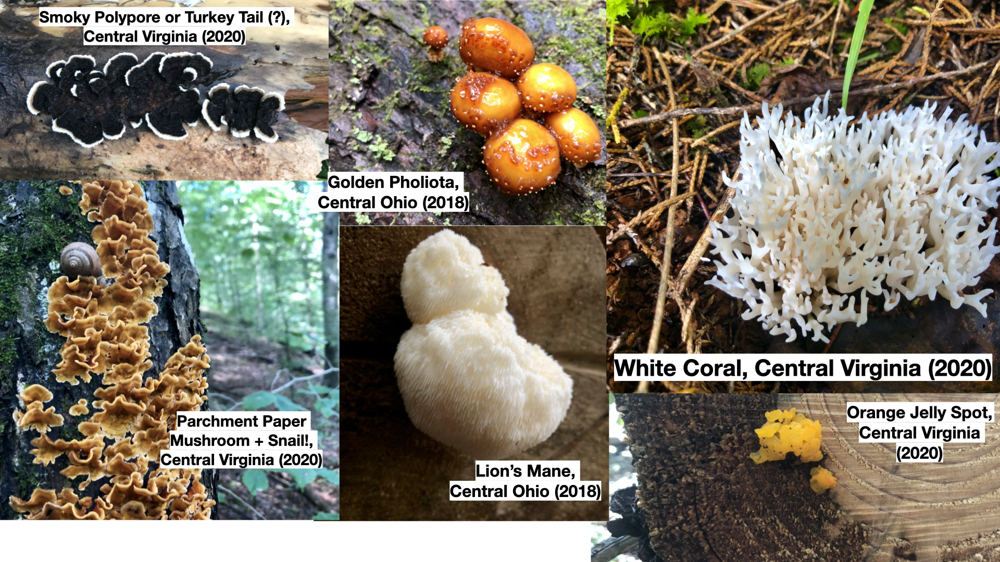

## Outside of my work, you can find me: ##

  
### Hiking!

I love to hike and identify plants and fungi.

### Reading!

Some books that have been on my mind recently:

- [The Alignment Problem](https://www.goodreads.com/book/show/53429525-the-alignment-problem)
- [The Urge](https://www.goodreads.com/book/show/32701181-the-urge)
- [If Anyone Builds It, Everyone Dies](https://www.goodreads.com/book/show/61429152-if-anyone-builds-it-everyone-dies)

### Watching Movies!

Here are a few favorites of mine recently:

- [Sing Sing](https://www.imdb.com/title/tt0081326/)
- [The Substance](https://www.imdb.com/title/tt26466964/)
- [The Sound of Music](https://www.imdb.com/title/tt0059742/)

