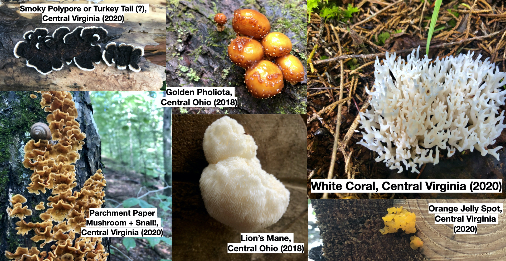
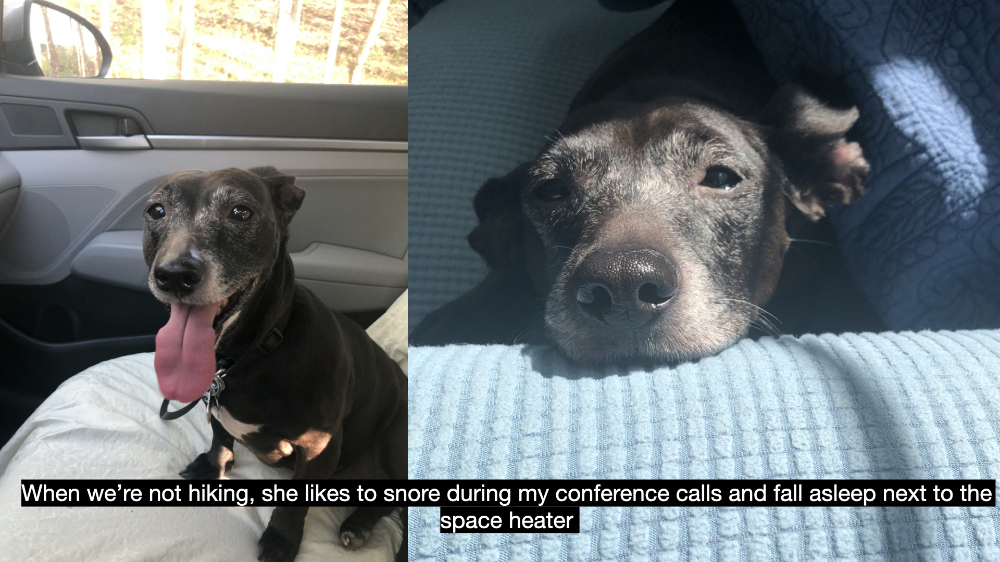
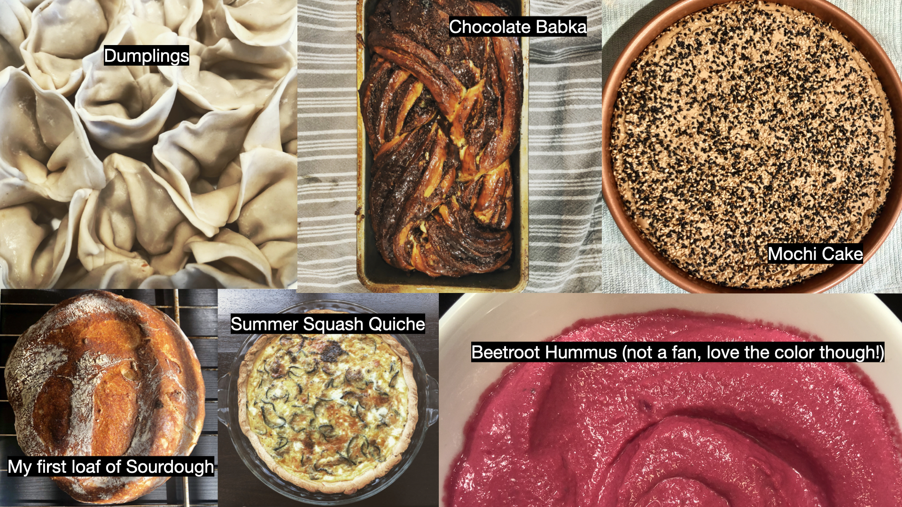

## Outside of my work, you can find me: ##

 

### 1. Staying safe! ###

Here are some ways that you can stay safe during the COVID-19 pandemic!

 

__Want [more information](https://www.who.int/emergencies/diseases/novel-coronavirus-2019/advice-for-public) on how to stay safe?__

  

### 2. In the woods! ###

I love to hike and spend time outside. I took a class in college on mushrooms and fungi, and have since become an amateur mycologist. Here are a few of my favorites that I've found:

  

I am most often joined on my hikes by my mom's dachshund mix, Pepper!

  

 

### 3. In the kitchen! ###

I love to cook! Even more than that, I love to eat! Here's what I've been cooking as of late:

  