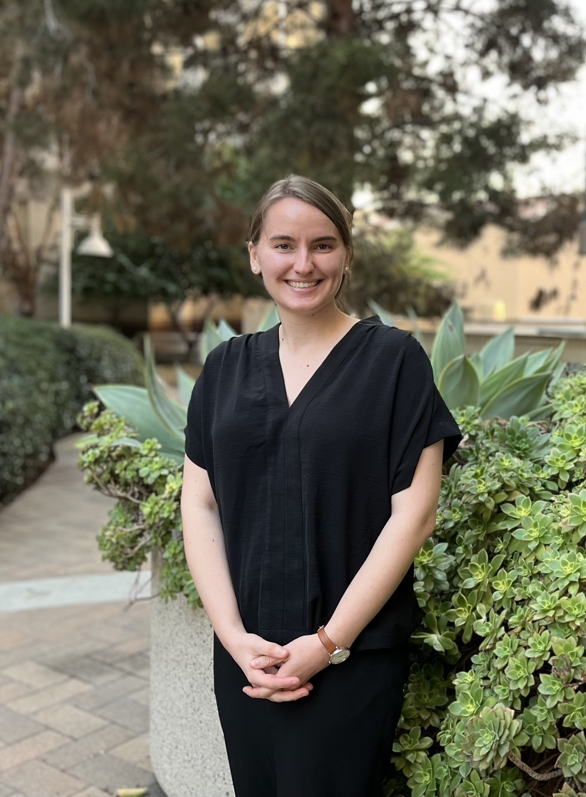

  

I am currently a Doctoral Candidate in Clinical Psychology at the University of California, Irvine. I'm a mental health professional, researcher, and computer scientist (and sometimes all three at the same time!). My research focuses on the intersection of mental health and advanced technologies. I will be applying for clinical internship in 2026-2027. 

You can find past work of mine [here](https://scholar.google.com/citations?user=tV5UcbwAAAAJ&hl=en)

  

__Interested in collaborating? [Reach out](mailto:kwislock@uci.edu)!__
